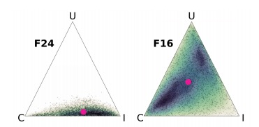
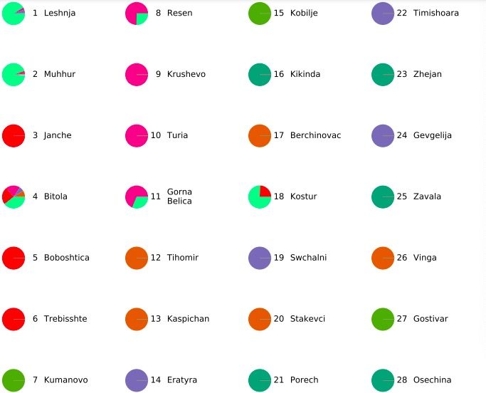
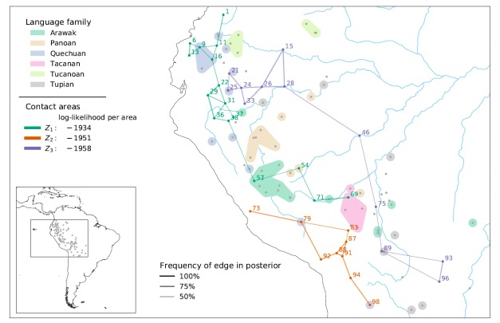
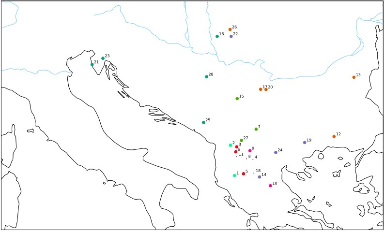
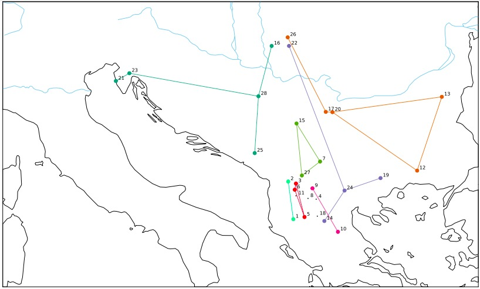
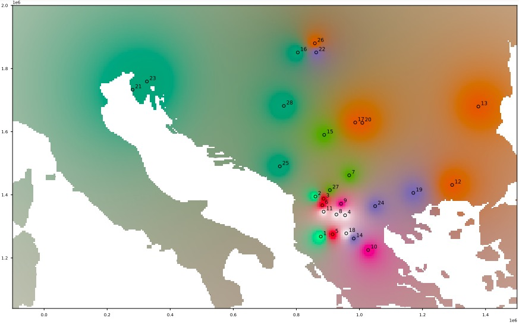

# 
sBlot Documentation
#### 
April 2026

## Table of contents
1. [Introduction](#1-introduction)
2. [Available Plots](#2-available-plots)
3. [Plot configuration](#3-plot-configuration)
4. [Style configuration](#4-style-configuration)
5. [Creating plots](#5-creating-plots)
6. [Examples](#6-examples)

## 1 Introduction

This document explains how to use the `sBlot` package to visualise the results of an `sBayes` analysis.  
`sBayes` is a clustering method that identifies groups with similar features while accounting for similarities
due to known confounders. Users can create five main types of plots:

1. [**Weight plots**](#21-weight-plots) visualise the weights assigned to each confounder and each of the clusters.
2. [**Preference plots**](#22-preference-plots) show the distribution of a feature in each cluster and in each group within each confounder.
3. [**Pie plots**](#23-pie-plots) show the membership of objects to clusters.
4. [**LOO plots**](#24-loo-plots) compare the Pareto-Smoothed Importance Leave-One-Out Cross-Validation (PSIS-LOO) for models with different numbers of clusters.
5. [**Maps**](#25-maps) visualise the spatial allocation of objects to clusters.

Users define all plotting parameters in two configuration files:

* **`config_plot.yaml`** specifies the input data and results of the `sBayes` analysis to visualise, the plots to generate, and the analytical tasks to perform for each plot.
* **`config_style.yaml`** defines the graphical style, including colors and font sizes.

Typically, users provide all parameters in the `config_plot.yaml` file, but use the pre-set style parameters for `config_style.yaml`, modifying only selected parameters as needed.

## 2 Available plots
### 2.1 Weight plots
Weight plots visualise the posterior densities of the weights per feature: how well does each 
effect – the confounders and the clustering – explain the distribution of the feature in the 
data? For example, a language analysis will likely have two confounders: inheritance and universal preference.
In this case, the weights are displayed in a triangular probability simplex. The lower right corner is the weight for inheritance 
(I), the upper corner is the weight for universal preference (U), and the lower 
left corner is the cluster weight (C). Figure 1 shows the 
 weight plots for two features, F24 and F16. Inheritance and clustering best explain the distribution of F24, whereas F26 has no single 
dominant explanation: the posterior weights are broadly distributed. The pink dot marks the 
mean of the distribution. As with other plot types, `sBlot` returns the density 
plots for all features in a single grid.

    
     
    
Figure 1. Weight plots for two features (F24, F16)

Further reading:
- [How to set up weight plots in **`config_plot.yaml`**.](#weight-plots-plotsweights)
- [How to change the appearance of weight plots in **`config_style.yaml`**.](#weight-plots-weights)
- How to render weight plots.

### 2.2 Preference plots
These plots visualise the distribution of a feature across groups defined by a 
confounder or within clusters. For example, in language analysis, one would typically control 
for inheritance within a language family and plot a separate preference plot for each family.

The appearance of the plot depends on the number of states: 
for two states, densities are shown as ridge plots (see Figure 6); 
for three states, as a triangular probability simplex (similar to the weights plots in the previous section); 
for four states, as a square; for five, as a pentagon; and so on. 
`sBlot` returns density plots for all features per confounder or cluster in a single grid.

Figure 2 shows the density plots for features F1 and F2, each with two states (N, Y), in cluster 1. 
While the posterior distribution for F1 is only weakly informative, with a slight tendency toward Y, 
F2 clearly favors state N.

    
     
    
Figure 2. The density plot shows the posterior preference for two features (F1, F2) in a cluster.

Further reading:
- [How to set up preference plots in **`config_plot.yaml`**.](#preference-plots-plotspreferences)
- [How to change the appearance of preference plots in **`config_style.yaml`**.](#preference-plots-preferences)
- How to create preference plots.

## 2.3 Pie plots
The pie plots show how often each object is assigned to each cluster in the posterior, 
for example, how often a language is assigned to each cluster. Figure 3 shows pie plots from an `sBayes` 
language analysis with seven clusters.

    
     
    
Figure 3. Pie plot for an `sBayes` analysis with seven clusters.

Further reading:
- [How to set up pie plots in **`config_plot.yaml`**.](#pie-plots-plotspies)
- [How to change the appearance of pie plots in **`config_style.yaml`**.](#pie-plots-pies)
- How to render pie plots.

### 2.4 LOO plots

Pareto-smoothed importance sampling leave-one-out cross-validation (PSIS-LOOCV) 
is a method for assessing model performance that balances predictive accuracy and model complexity. 
LOO plots show the expected predictive performance across several models, typically with an increasing number of clusters, K, 
and help the analyst choose an appropriate value of K. As a rule of thumb, the preferred model is 
the one beyond which improvements in predictive performance become negligible. 
Figure 7 shows PSIS-LOO results for seven models with increasing numbers of areas (K = 1 to K = 7). The curve levels off at K = 2, suggesting two 
salient clusters in the data.

Because PSIS-LOO compares predictive performance across models, it requires multiple result files as input.

Further reading:
- [How to set up a LOO plot **`config_plot.yaml`**.](#loo-plots-plotsloo)
- [How to change the appearance of a LOO plot **`config_style.yaml`**.](#loo-plots-loo)
- How to render a LOO plot.

### 2.5 Maps
Clusters in `sBayes` typically have a geographic interpretation. 
Maps show the posterior distribution of clusters in geographic space. 
They include the spatial location of each object, 
its assignment to clusters, and optionally its assignment to confounders (e.g., to a language family). 
Users can also add a basemap, a legend, and an overview map.
Figure 4 shows an example of a map from an `sBayes` language analysis in South America with three clusters. 

    
     
    
Figure 4. A map of an sBayes analysis in South America. 

There are three types of maps:
1. In a **dot map**, objects in the same cluster share the same marker color. 
   Dot size can indicate how often an object is assigned to a cluster. 
   Figure 4 shows a dot map from an `sBayes` language analysis of the Balkans with seven clusters.
    

        
         
        
Figure 4. A dot map with seven clusters.

    

2. **Line maps** connect neighboring objects that belong to the same 
   cluster with lines. Line thickness indicates how often two objects are assigned to the same cluster. 
   Figure 5 shows a line map from a language analysis of the Balkans with seven clusters.
    

        
         
        
Figure 5. A line map with seven clusters.

    

3. **Inverse Distance Weighting (IDW) maps** produce a gradual spatial interpolation of clusters. 
   Objects in a cluster are assigned a color that radiates into the surrounding space, 
   so nearby locations appear more similar in color. Figure 6 shows an IDW map of the Balkans with seven clusters.
   

        
         
        
Figure 6. An IDW map with seven clusters.

    

For dot and line maps, users can choose between **density maps**, which show the full posterior distribution 
and preserve the model’s uncertainty, and **consensus maps**, which provide a simplified summary of the posterior. 
Consensus maps retain only objects that appear in a cluster above a specified threshold.

Further reading:
- [How to set up maps in **`config_plot.yaml`**.](#maps-plotsmap)
- [How to change the appearance of maps in **`config_style.yaml`**.](#maps-map)
- How to render maps.

## 3 Plot configuration

The **`config_plot.yaml`** file specifies the input data and results of 
an `sBayes` analysis for visualisation, along with the plots to generate and the 
analytical tasks to perform for each plot.

It consists of three main sections:
- [**results**](#31-results-results): file paths to the outputs of an `sBayes` analysis  
- [**data**](#32-data-data): file paths to the empirical data used in the analysis  
- [**plots**](#33-plots-plots): definitions of the plots to generate and the associated analytical tasks  

### 3.1 Results (`results`)
Specify the input and output paths for an `sBayes` run, along with parameters controlling how posterior samples are processed.

| Key        | Type   | Default           | Description                                                              |
|------------|--------|-------------------|--------------------------------------------------------------------------|
| `path_in`  | string | *required*        | Path to the results files (clusters and stats) from an `sBayes` analysis |
| `path_out` | string | `{path_in}_plots` | Directory where generated plots will be saved                            |
| `burn_in`  | float  | `0.2`             | Fraction of samples to discard as burn-in (0.0–1.0)                      |
| `thinning` | int    | `1`               | Keep every *n*th sample to reduce memory usage                           |

### 3.2 Data (`data`)
Specify the input data used in the analysis, including feature definitions and spatial reference information.

| Key             | Type   | Default      | Description                                                                                     |
|-----------------|--------|--------------|-------------------------------------------------------------------------------------------------|
| `features`      | string | *required*   | Path to the features CSV file                                                                   |
| `feature_types` | string | *required*   | Path to the `feature_types.yaml` file defining the type of each feature                         |
| `projection`    | string | `epsg:4326`  | Coordinate reference system (CRS) of the input data (PROJ string or EPSG). For `map` plots only |

Note that the projection might differ from the `map_projection` in `config_style.yaml`.

### 3.3 Plots (`plots`)

Defines which plots to generate and their configuration.

| Key           | Description                                                                                         |
|---------------|-----------------------------------------------------------------------------------------------------|
| `weights`     | Weight plots showing posterior weight distributions                                                 |
| `preferences` | Preference plots showing the posterior distribution of features in the clusters and the confounders |
| `pies`        | Pie chart plots showing cluster membership per object                                               |
| `loo`         | Loo plots compare models with different numbers of clusters.                                        |
| `map`         | Posterior map showing cluster assignments in geographic space                                       |

The sections below describe each plot type in more detail. 

#### Weight plots (`plots.weights`)
Weight plots show the posterior weight distributions.

| Key        | Type         | Required | Default | Description                                    |
|------------|--------------|----------|---------|------------------------------------------------|
| `features` | list[string] | No       | `[]`    | Features to plot. Empty = plot all features    |

#### Preference plots (`plots.preferences`)
Preference plots show the posterior distribution of features in the clusters and each group of the confounders.

| Key          | Type         | Default    | Description                                                                 |
|--------------|--------------|------------|-----------------------------------------------------------------------------|
| `features`   | list[string] | `[]`       | Feature names to plot. Empty = plot all features                            |
| `components` | list         | `[]`       | Components to plot. Empty = plot all components.                            |
| `reference`  | string       | `null`     | Reference component shown as overlay behind each plot. `null` = no overlay  |

#### `plots.preferences.components`
Each entry in `components` has the following keys. Only relevant when `components` is provided.

| Key         | Type         | Default    | Description                                                                              |
|-------------|--------------|------------|------------------------------------------------------------------------------------------|
| `component` | string       | *required* | Component name; either a confounder (e.g. `family`, `universal`) or `clusters`           |
| `groups`    | list[string] | `[]`       | Groups to plot within the component. Empty = plot all groups e.g. `["Turkic", "Altaic"]` |

### Pie plots (`plots.pies`)
Pie chart plots show the posterior cluster membership per object.

| Key       | Type    | Default | Description                                                        |
|-----------|---------|---------|--------------------------------------------------------------------|
| `enabled` | boolean | `false` | Whether to generate pie charts. Set to `true` to enable this plot  |

### Loo plots (`plots.loo`)
PSIS-LOO plots compare the posterior support for different models.

| Key       | Type    | Default | Description                                                              |
|-----------|---------|---------|--------------------------------------------------------------------------|
| `enabled` | boolean | `false` | Whether to generate the PSIS-LOO plot. Set to `true` to enable this plot |

### Maps (`plots.map`)
The posterior maps show cluster assignments in geographic space.

| Key                         | Type    | Default   | Description                                                                                     |
|-----------------------------|---------|-----------|-------------------------------------------------------------------------------------------------|
| `type`                      | string  | `line`    | Map type: `line` = scatter plot graph, `dot` = pie charts, `idw` = interpolated map             |
| `plot_confounder`           | string  | `null`    | Confounder to overlay on the map as alpha shapes e.g. `family`. `null` = no overlay             |
| `labels`                    | string  | `all`     | Which objects to label: `all`, `in_cluster` or `none`                                           |
| `min_posterior_probability` | float   | `null`    | Minimum posterior probability for an object to appear in the cluster. `null` = show all objects |
| `per_cluster`               | boolean | `false`   | Generate one map per cluster instead of all clusters combined                                   |
| `line`                      | dict    | —         | Line map settings. Only relevant when `type` is `line`. See below                               |
| `idw`                       | dict    | —         | IDW map settings. Only relevant when `type` is `idw`. See below                                 |

#### `plots.map.line`
Line map settings. 

| Key     | Type   | Default   | Description                                                                         |
|---------|--------|-----------|-------------------------------------------------------------------------------------|
| `graph` | string | `gabriel` | Graph type connecting objects within a cluster: `gabriel`, `delaunay` or `complete` |

#### `plots.map.idw`
Settings for a map with inverse distance weighted interpolation.

| Key                 | Type  | Default | Description                                                      |
|---------------------|-------|---------|------------------------------------------------------------------|
| `resolution`        | int   | `50000` | Grid cell size in map CRS units. Smaller = finer grid, slower    |
| `power`             | int   | `2`     | Distance decay power. Higher = more influence from nearby points |
| `background_weight` | float | `1.0`   | Weight of background color in areas far from any data point      |

## 4 Style configuration
The **`config_style.yaml`** file defines the graphical styling for all plots, including colors, fonts, and output settings.

### Global settings (`global`)
The global settings apply to all plots and define the output format, resolution, and cluster colors used throughout the visualisations.

| Key               | Type         | Default  | Description                                                                                                       |
|-------------------|--------------|----------|-------------------------------------------------------------------------------------------------------------------|
| `format`          | string       | `pdf`    | Output file format for all plots: `pdf`, `png` or `svg`                                                           |
| `resolution`      | int          | `300`    | Output resolution in DPI. Typical values: `300` (print), `96` (screen)                                            |
| `cluster_colors`  | list[string] | `[]`     | Hex color strings for each cluster. Used consistently across all plots. Empty = auto-generate colors              |

### Weight plots (`weights`)
Style settings for weight plots.

| Key                          | Type    | Default   | Description                                           |
|------------------------------|---------|-----------|-------------------------------------------------------|
| `simplex`                    | dict    | —         | Style settings for the probability simplex. See below |
| `mean`                       | dict    | —         | Style settings for the mean weight marker. See below  |
| `legend`                     | dict    | —         | Style settings for the legend. See below              |
| `output`                     | dict    | —         | Output settings for the grid layout. See below        |

#### `weights.simplex`
Controls the appearance of the probability simplex.

| Key             | Type   | Default   | Description                                                                                                                           |
|-----------------|--------|-----------|---------------------------------------------------------------------------------------------------------------------------------------|
| `color`         | string | `#005570` | Color of the density curve and border for models with two components. For more components a cubehelix color map is used automatically |
| `border_width`  | float  | `0.2`     | Line width of the triangular simplex border                                                                                           |
| `padding`       | float  | `0.1`     | Padding around the simplex in axis units                                                                                              |
| `label_stretch` | float  | `1.15`    | Stretch factor for corner label positions (>1 moves labels outward)                                                                   |

#### `weights.mean`
Controls the marker shown at the mean weight position inside the simplex.

| Key      | Type    | Default   | Description                                 |
|----------|---------|-----------|---------------------------------------------|
| `show`   | boolean | `true`    | Whether to plot the mean weight as a marker |
| `color`  | string  | `#ed1696` | Color of the mean marker                    |
| `size`   | int     | `10`      | Size of the mean marker in points²          |
| `marker` | string  | `o`       | Matplotlib marker style                     |

#### `weights.legend`
Controls the legend elements shown in each simplex panel.

| Key             | Type | Default | Description                                                    |
|-----------------|------|---------|----------------------------------------------------------------|
| `title`         | dict | —       | Style settings for the feature name title. See below           |
| `corner_labels` | dict | —       | Style settings for the corner labels of the simplex. See below |

#### `weights.legend.title`
Controls the feature name displayed above each simplex panel.

| Key          | Type    | Default | Description                                    |
|--------------|---------|---------|------------------------------------------------|
| `add`        | boolean | `true`  | Whether to add the feature name as a title     |
| `font_size`  | int     | `6`     | Font size of the title                         |
| `position.x` | float   | `0`     | Horizontal position in axes coordinates (0–1)  |
| `position.y` | float   | `1`     | Vertical position in axes coordinates (0–1)    |

#### `weights.legend.corner_labels`
Controls the component labels shown for each corner of the simplex.

| Key         | Type    | Default | Description                                                              |
|-------------|---------|---------|--------------------------------------------------------------------------|
| `add`       | boolean | `true`  | Whether to add corner labels                                             |
| `font_size` | int     | `6`     | Font size of the corner labels. Labels are inferred from component names |

#### `weights.output`
Controls the size and spacing of the simplex panel grid.

| Key                  | Type  | Default | Description                                   |
|----------------------|-------|---------|-----------------------------------------------|
| `width_subplot`      | float | `2`     | Width of each simplex panel in inches         |
| `height_subplot`     | float | `2`     | Height of each simplex panel in inches        |
| `n_columns`          | int   | `5`     | Number of columns in the simplex grid         |
| `spacing_horizontal` | float | `0.1`   | Horizontal spacing between panels (wspace)    |
| `spacing_vertical`   | float | `0.1`   | Vertical spacing between panels (hspace)      |

### Preference plots (`preferences`)
Style settings for preference plots.

| Key               | Type   | Default   | Description                                                                                                                         |
|-------------------|--------|-----------|-------------------------------------------------------------------------------------------------------------------------------------|
| `color`           | string | `#005570` | Color of the density curve and border for features with two states. For more components a cubehelix color map is used automatically |
| `reference_color` | string | `#b0b0b0` | Color of the reference component overlay                                                                                            |
| `legend`          | dict   | —         | Style settings for the legend. See below                                                                                            |
| `output`          | dict   | —         | Output settings for the grid layout. See below                                                                                      |

#### `preferences.legend`
Controls the legend elements shown in each simplex panel.

| Key      | Type | Default | Description                                            |
|----------|------|---------|--------------------------------------------------------|
| `labels` | dict | —       | Style settings for the state labels at simplex corners |
| `title`  | dict | —       | Style settings for the feature name title              |

#### `preferences.legend.labels`
Controls the state labels shown for each corner of the simplex.

| Key         | Type    | Default | Description                              |
|-------------|---------|---------|------------------------------------------|
| `add`       | boolean | `true`  | Whether to add state labels              |
| `font_size` | int     | `4`     | Font size of the state labels            |

#### `preferences.legend.title`
Controls the feature name displayed above each simplex panel.

| Key          | Type    | Default | Description                                   |
|--------------|---------|---------|-----------------------------------------------|
| `add`        | boolean | `true`  | Whether to add the feature name as a title    |
| `font_size`  | int     | `6`     | Font size of the title                        |
| `position.x` | float   | `0`     | Horizontal position in axes coordinates (0–1) |
| `position.y` | float   | `1`     | Vertical position in axes coordinates (0–1)   |

#### `preferences.output`
Controls the size and spacing of the simplex panel grid.

| Key                  | Type  | Default | Description                            |
|----------------------|-------|---------|----------------------------------------|
| `width_subplot`      | float | `3`     | Width of each simplex panel in inches  |
| `height_subplot`     | float | `3`     | Height of each simplex panel in inches |
| `n_columns`          | int   | `5`     | Number of columns in the simplex grid  |
| `spacing_horizontal` | float | `0.2`   | Horizontal spacing between panels      |
| `spacing_vertical`   | float | `0.3`   | Vertical spacing between panels        |

### Pie plots (`pies`)
Style settings for pie chart plots showing cluster membership per object.

| Key      | Type | Default | Description                                      |
|----------|------|---------|--------------------------------------------------|
| `label`  | dict | —       | Style settings for object labels                 |
| `pie`    | dict | —       | Style settings for individual pie charts         |
| `axes`   | dict | —       | Axes limits and label positions                  |
| `output` | dict | —       | Output settings for the grid layout              |

#### `pies.label`
Controls the appearance of object labels next to each pie chart.

| Key                | Type | Default | Description                                                           |
|--------------------|------|---------|-----------------------------------------------------------------------|
| `index_size`       | int  | `15`    | Font size of the object index number                                  |
| `name_size`        | int  | `15`    | Font size of the object name                                          |
| `max_label_length` | int  | `10`    | Character threshold above which long labels are broken into two lines |

#### `pies.pie`
Controls the appearance of individual pie charts.

| Key                | Type   | Default     | Description                                   |
|--------------------|--------|-------------|-----------------------------------------------|
| `radius`           | float  | `15`        | Pie chart radius in axis units                |
| `no_cluster_color` | string | `lightgrey` | Color for objects not assigned to any cluster |

#### `pies.axes`
Controls the axes limits and label positions within each pie panel.

| Key       | Type  | Default | Description                                                |
|-----------|-------|---------|------------------------------------------------------------|
| `x_min`   | float | `0`     | Minimum x axis limit                                       |
| `x_max`   | float | `160`   | Maximum x axis limit                                       |
| `y_min`   | float | `-10`   | Minimum y axis limit                                       |
| `y_max`   | float | `10`    | Maximum y axis limit                                       |
| `index_x` | float | `0.20`  | Horizontal position of the index label in axes coordinates |
| `name_x`  | float | `0.25`  | Horizontal position of the name label in axes coordinates  |
| `label_y` | float | `0.5`   | Vertical position of both labels in axes coordinates       |

#### `pies.output`
Controls the size and spacing of the pie chart grid.

| Key                  | Type  | Default | Description                             |
|----------------------|-------|---------|-----------------------------------------|
| `width`              | float | `4`     | Width of each pie panel in inches       |
| `height`             | float | `2`     | Height of each pie panel in inches      |
| `n_columns`          | int   | `10`    | Number of columns in the pie chart grid |
| `spacing_horizontal` | float | `0.01`  | Horizontal spacing between panels       |
| `spacing_vertical`   | float | `0.01`  | Vertical spacing between panels         |

### Loo plots (`loo`)
Style settings for PSIS-LOO model comparison plots.

| Key          | Type   | Default   | Description                                                                                      |
|--------------|--------|-----------|--------------------------------------------------------------------------------------------------|
| `output`     | dict   | —         | Output settings for the plot                                                                     |
| `box_color`  | string | `#005570` | Fill color of box plots. Used when only one value of k is present                               |
| `line_width` | float  | `0.5`     | Line width of the ELPD-LOO curves. Used when multiple values of k are present                   |
| `line_style` | string | `dashed`  | Line style of the ELPD-LOO curves. Used when multiple values of k are present                   |

#### `loo.output`

| Key          | Type  | Default | Description                        |
|--------------|-------|---------|------------------------------------|
| `width`      | float | `10`    | Width of the figure in inches      |
| `height`     | float | `6`     | Height of the figure in inches     |

### Maps (`map`)
Style settings for the posterior map.

| Key        | Type | Default | Description                                         |
|------------|------|---------|-----------------------------------------------------|
| `geo`      | dict | —       | Geographic settings including projection and extent |
| `graphics` | dict | —       | Visual settings for objects, clusters and base map  |
| `legend`   | dict | —       | Settings for all legend elements                    |
| `output`   | dict | —       | Output dimensions                                   |

#### `map.geo`
Controls the geographic projection, extent and base map data sources.

| Key              | Type   | Default | Description                                                                                      |
|------------------|--------|---------|--------------------------------------------------------------------------------------------------|
| `map_projection` | string | `null`  | CRS for rendering the map (PROJ string or EPSG code). Defaults to the data projection if not set |
| `extent`         | dict   | —       | Map extent in map CRS units. Defaults to the data extent if not set                              |
| `basemap`        | dict   | —       | Base map data sources                                                                            |

#### `map.geo.extent`
Controls the map extent. 

| Key     | Type  | Default | Description                                              |
|---------|-------|---------|----------------------------------------------------------|
| `x_min` | float | `null`  | Minimum x extent. `null` = auto-compute from data extent |
| `x_max` | float | `null`  | Maximum x extent. `null` = auto-compute from data extent |
| `y_min` | float | `null`  | Minimum y extent. `null` = auto-compute from data extent |
| `y_max` | float | `null`  | Maximum y extent. `null` = auto-compute from data extent |

#### `map.geo.basemap`
Controls which geographic data files are used for the base map.

| Key       | Type    | Default     | Description                                                                                |
|-----------|---------|-------------|--------------------------------------------------------------------------------------------|
| `add`     | boolean | `true`      | Whether to add a base map                                                                  |
| `polygon` | string  | `<DEFAULT>` | Path to a GeoJSON polygon file (land masses). `<DEFAULT>` = use bundled Natural Earth data |
| `line`    | string  | `<DEFAULT>` | Path to a GeoJSON line file (rivers, lakes). `<DEFAULT>` = use bundled Natural Earth data  |
| `point`   | string  | `null`      | Path to a GeoJSON point file (e.g. cities). `null` = no point layer                        |

#### `map.graphics`
Controls the visual appearance of objects, clusters, confounders and the base map.

| Key           | Type | Default | Description                                |
|---------------|------|---------|--------------------------------------------|
| `objects`     | dict | —       | Style settings for  objects on the map     |
| `clusters`    | dict | —       | Style settings for cluster assignments     |
| `confounders` | dict | —       | Style settings for confounder alpha shapes |
| `basemap`     | dict | —       | Style settings for base map layers         |

#### `map.graphics`
Controls the visual appearance of objects, clusters, confounders and the base map.

| Key           | Type | Default | Description                                |
|---------------|------|---------|--------------------------------------------|
| `objects`     | dict | —       | Style settings for all objects on the map  |
| `clusters`    | dict | —       | Style settings for cluster assignments     |
| `confounders` | dict | —       | Style settings for confounder alpha shapes |
| `basemap`     | dict | —       | Style settings for base map layers         |

#### `map.graphics.objects`
Controls the appearance of objects plotted on the map.

| Key         | Type    | Default   | Description                              |
|-------------|---------|-----------|------------------------------------------|
| `color`     | string  | `#000000` | Color of object markers                  |
| `marker`    | string  | `o`       | Matplotlib marker style                  |
| `size`      | float   | `5`       | Marker size in points squared            |
| `label`     | boolean | `true`    | Whether to add numeric labels to objects |
| `font_size` | int     | `5`       | Font size of object labels               |

#### `map.graphics.clusters`
Controls the appearance of cluster assignments on the map.

| Key                 | Type          | Default       | Description                                                                           |
|---------------------|---------------|---------------|---------------------------------------------------------------------------------------|
| `marker`            | string        | `o`           | Matplotlib marker style for cluster objects                                           |
| `color`             | string        | `max_cluster` | Object color: `max_cluster` = color by dominant cluster, `as_objects` = neutral color |
| `size`              | string\|float | `frequency`   | Marker size: `frequency` = scale by posterior probability, or fixed float e.g. `10`   |
| `max_size`          | float         | `50`          | Maximum marker size when `size` is `frequency`                                        |
| `line_width`        | string\|float | `frequency`   | Line width: `frequency` = scale by posterior probability, or fixed float e.g. `1.0`   |
| `max_line_width`    | float         | `1`           | Maximum line width when `line_width` is `frequency`                                   |
| `alpha`             | string\|float | `frequency`   | Opacity: `frequency` = scale by posterior probability, or fixed float e.g. `0.8`      |
| `pie_radius_factor` | float         | `0.008`       | Base pie radius as a fraction of the minimum map spa. For `dot` map only.             |

#### `map.graphics.confounders`
Controls the appearance of confounder alpha shapes on the map.

| Key      | Type         | Default | Description                                                    |
|----------|--------------|---------|----------------------------------------------------------------|
| `size`   | float        | `180`   | Marker size for confounder scatter points in points squared    |
| `color`  | list[string] | `[]`    | Colors for each confounder group. Empty = auto-generate colors |
| `buffer` | float        | `0.5`   | Buffer distance around alpha shapes in map CRS units           |
| `shape`  | float        | `20`    | Alpha shape concavity parameter. Larger = tighter shape        |

#### `map.graphics.basemap`
Controls the visual appearance of base map layers.

| Key                     | Type   | Default   | Description                             |
|-------------------------|--------|-----------|-----------------------------------------|
| `background`            | string | `#f0f8ff` | Background color of the map axes        |
| `polygon.color`         | string | `white`   | Fill color of land polygons             |
| `polygon.outline_color` | string | `grey`    | Outline color of (land) polygons        |
| `polygon.outline_width` | float  | `0.1`     | Outline width of (land) polygons        |
| `line.color`            | string | `skyblue` | Color of (river and lake) lines         |
| `line.width`            | float  | `0.5`     | Width of (river and lake) lines         |
| `point.color`           | string | `black`   | Color of point markers                  |
| `point.size`            | float  | `10`      | Size of point markers in points squared |
| `point.marker`          | string | `o`       | Matplotlib marker style for points      |

#### `map.legend`
Controls which legend elements are shown and where.

| Key            | Type | Default | Description                                              |
|----------------|------|---------|----------------------------------------------------------|
| `clusters`     | dict | —       | Legend entry for cluster lines                           |
| `confounders`  | dict | —       | Legend entry for confounder alpha shapes                 |
| `lines`        | dict | —       | Legend entry for line width reference                    |
| `overview_map` | dict | —       | Inset overview map                                       |
| `index_table`  | dict | —       | Correspondence table mapping object numbers to names     |

#### `map.legend.clusters`
Legend for clusters.

| Key              | Type    | Default | Description                                             |
|------------------|---------|---------|---------------------------------------------------------|
| `add`            | boolean | `true`  | Whether to add the cluster legend                       |
| `log_likelihood` | boolean | `false` | Whether to show log likelihood values as cluster labels |
| `font_size`      | int     | `10`    | Font size of legend labels                              |
| `position.x`     | float   | `0.005` | Horizontal position in axes coordinates (0–1)           |
| `position.y`     | float   | `0.95`  | Vertical position in axes coordinates (0–1)             |

#### `map.legend.confounders`
Legend for confounders. 

| Key          | Type    | Default | Description                                   |
|--------------|---------|---------|-----------------------------------------------|
| `add`        | boolean | `true`  | Whether to add the confounder legend          |
| `font_size`  | int     | `10`    | Font size of legend labels                    |
| `position.x` | float   | `0.005` | Horizontal position in axes coordinates (0–1) |
| `position.y` | float   | `0.8`   | Vertical position in axes coordinates (0–1)   |

#### `map.legend.lines`
Only relevant for `line` maps. Controls the line width reference legend showing posterior frequency scale.

| Key                     | Type        | Default           | Description                                                  |
|-------------------------|-------------|-------------------|--------------------------------------------------------------|
| `add`                   | boolean     | `true`            | Whether to add the line width legend                         |
| `font_size`             | int         | `10`              | Font size of legend labels                                   |
| `position.x`            | float       | `0.005`           | Horizontal position in axes coordinates (0–1)                |
| `position.y`            | float       | `0.5`             | Vertical position in axes coordinates (0–1)                  |
| `reference_frequencies` | list[float] | `[0.5, 0.7, 0.9]` | Posterior frequencies shown as reference lines in the legend |

#### `map.legend.overview_map`
Controls the inset overview map showing broader geographic context.

| Key               | Type    | Default | Description                                                   |
|-------------------|---------|---------|---------------------------------------------------------------|
| `add`             | boolean | `false` | Whether to add the overview map                               |
| `extent_factor.x` | float   | `1.5`   | How much wider the overview is relative to the main map       |
| `extent_factor.y` | float   | `1.5`   | How much taller the overview is relative to the main map      |
| `width`           | float   | `0.3`   | Width of the overview window as a fraction of the main image  |
| `height`          | float   | `0.3`   | Height of the overview window as a fraction of the main image |
| `position.x`      | float   | `0.005` | Horizontal position in axes coordinates (0–1)                 |
| `position.y`      | float   | `0.15`  | Vertical position in axes coordinates (0–1)                   |

#### `map.legend.index_table`
Controls the index table mapping object numbers to names.

| Key            | Type    | Default | Description                                                                      |
|----------------|---------|---------|----------------------------------------------------------------------------------|
| `add`          | boolean | `true`  | Whether to add the index table                                                   |
| `show`         | string  | `all`   | Which objects to show: `all` or `in_cluster`                                     |
| `font_size`    | int     | `10`    | Font size of table entries                                                       |
| `n_columns`    | int     | `2`     | Number of columns in the table                                                   |
| `color_labels` | boolean | `true`  | Whether to color object names by their cluster color                             |
| `height`       | float   | `0.8`   | Height of the table as a fraction of the axes height                             |

#### `map.output`

| Key      | Type  | Default | Description                        |
|----------|-------|---------|------------------------------------|
| `width`  | float | `14`    | Width of the map figure in inches  |
| `height` | float | `10`    | Height of the map figure in inches |

## 5 Creating plots

