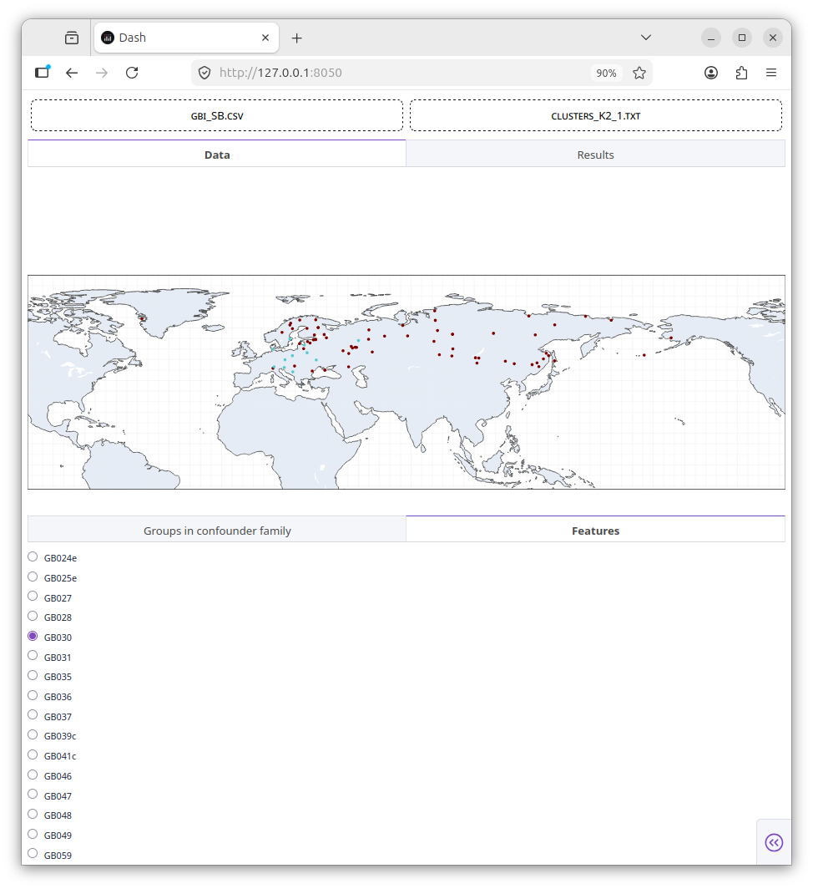
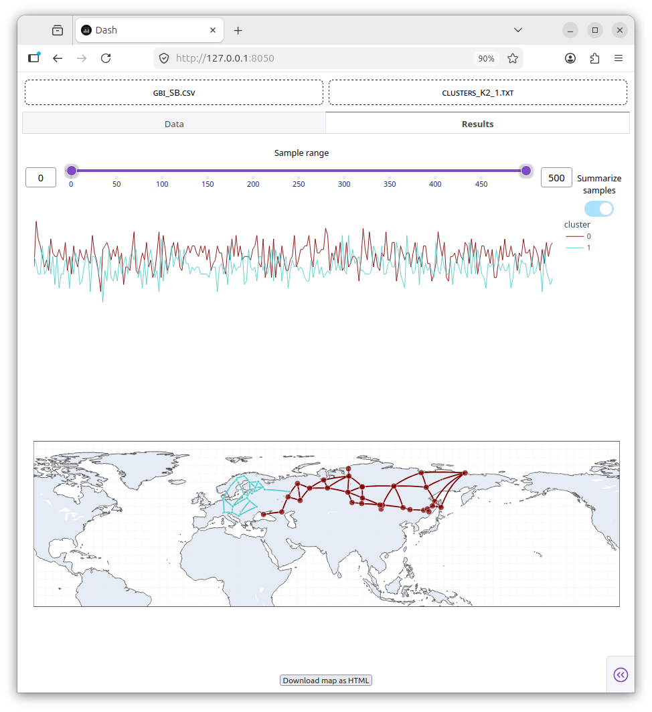

[← Back to documentation](index.md)

# Interactive explorer

The interactive explorer is a browser-based application for inspecting posterior samples from an `sBayes` analysis. 
Unlike static plots, the explorer allows users to interactively step through posterior samples or summarise them over a range, making it useful for diagnosing MCMC convergence and exploring the posterior distribution.

## Launching the explorer

From the command line:

`sblot-interactive --conf family`

Then open the interactive map in your browser at the address shown in the command line, e.g., http://127.0.0.1:8050/.

Additional options:

| Option         | Default     | Description                                                 |
|----------------|-------------|-------------------------------------------------------------|
| `--conf`       | *required*  | Name of the confounder column in the data CSV e.g. `family` |
| `-d`, `--data` | `null`      | Optional path to a data CSV file to pre-load on startup     |
| `-p`, `--port` | `8050`      | Port used to serve the application                          |
| `-c`, `--crs`  | `epsg:4326` | Coordinate reference system of the input data               |

## Data tab

After uploading a data CSV file, the Data tab shows a geographic map of all objects and two subtabs:

- **Groups by confounder**, a bar chart showing the number of objects per confounder group. Hovering over a bar highlights the corresponding objects on the map.
- **Features** a radio selector for coloring the map by feature value. Selecting a feature colors each object according to its state for that feature.

The figure below shows an interactive feature  map. 

    
     
    
The Data tab, showing an interactive feature map.

## Results tab

After uploading a clusters file (`clusters_*.txt`), the Results tab becomes available. It shows:

- **Trace plot**: the size of each cluster over all posterior samples, useful for inspecting MCMC mixing and convergence. Hovering over the trace plot highlights the corresponding cluster on the map.
- **Map**: a geographic map of cluster assignments. Two display modes are available:
  - **Summarise samples** shows the mean cluster assignment over a selected range of samples. Objects are assigned to the cluster with the highest mean posterior probability above a threshold of 0.5. The range is controlled by a range slider.
  - **Single sample** shows the cluster assignment for a single posterior sample. The sample is selected using a sample slider or by hovering over the trace plot.

    
     
    
The Results tab, showing a trace plot and an interactive map of the posterior.

## Downloading the map

The current map can be downloaded as a self-contained HTML file by clicking the **Download map as HTML** button. The downloaded file can be opened in any browser and shared without requiring sBlot to be installed.