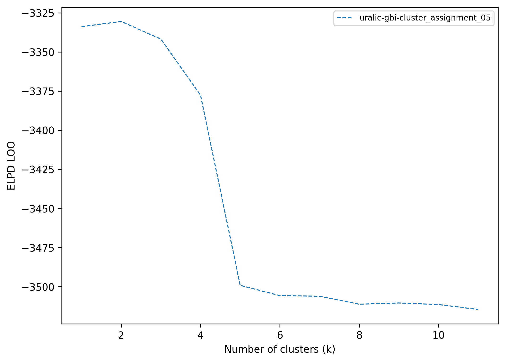

[← Back to documentation](../index.md)
# LOO plots

Pareto-smoothed importance sampling leave-one-out cross-validation (PSIS-LOOCV) 
is a method for assessing model performance that balances predictive accuracy and model complexity. 
LOO plots show the expected predictive performance across several models, typically with an increasing number of clusters, K, 
and help the analyst choose an appropriate value of K. As a rule of thumb, the preferred model is 
the one beyond which improvements in predictive performance become negligible. 
The figure below shows PSIS-LOO results for eleven models with increasing numbers of areas (K = 1 to 10 = 11). The curve peaks at K = 2, suggesting two 
salient clusters in the data.

    
     
    
PSIS-LOO model comparison for models with increasing numbers of clusters (K=1 to K=11).

Because PSIS-LOO compares predictive performance across models, it requires multiple result files as input.

Further reading:
- [How to set up a LOO plot in **`config_plot.yaml`**](../configuration/config_plot.md#loo-plots-plotsloo)
- [How to change the appearance of a LOO plot in **`config_style.yaml`**](../configuration/config_style.md#loo-plots-loo)
- [How to render a LOO plot](../quickstart.md#loo-plots)

