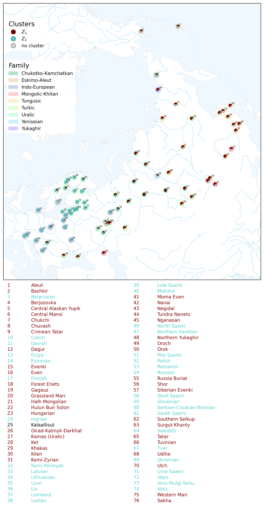

[← Back to documentation](../index.md)

# Maps

Clusters in `sBayes` typically have a geographic interpretation. Maps show the posterior distribution of clusters in geographic space. 
They include the spatial location of each object, its assignment to clusters, and optionally its assignment to confounders (e.g., to a language family). 
Users can also add a basemap, a legend, an overview map and an index table. 

There are three types of maps:
1. In a **pie map**, each object is shown as a pie chart where each slice represents the posterior probability of belonging to a cluster. This preserves the full uncertainty of the posterior distribution.
   The figure below shows a pie map with two clusters from an `sBayes` language analysis in Northern Eurasia.
    

        
         
        
A pie map of an sBayes language analysis with two clusters including an index table.

    

2. **Line maps** connect neighboring objects that belong to the same 
   cluster with lines. Line thickness indicates how often two objects are assigned to the same cluster. Point color indicates the dominant cluster for each language.
  The figure below shows a line map with two clusters from an `sBayes` language analysis in Northern Eurasia.
    

        
         
        
A line map of an sBayes language analysis with two clusters including an index table.

    

3. **Inverse Distance Weighting (IDW) maps** produce a gradual spatial interpolation of clusters. 
   Objects in a cluster are assigned a color that radiates into the surrounding space, 
   so nearby locations appear more similar in color. The figure below shows an IDW map with two clusters from an `sBayes` language analysis in Northern Eurasia.
   

    
     
    
An IDW map of an sBayes language analysis with two clusters including an index table.

   

For pie and line maps, users can control which objects appear on the map using
`min_posterior_probability` in `config_plot.yaml`. Objects below the threshold
are excluded from the map. To add separate maps for each cluster, set
`per_cluster: true`.

#### Further reading:
- [How to set up maps in **`config_plot.yaml`**](../configuration/config_plot.md#maps-plotsmap)
- [How to change the appearance of maps in **`config_style.yaml`**](../configuration/config_style.md#maps-map)
- [How to render maps](../quickstart.md#maps)