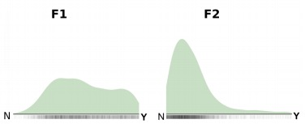

[← Back to documentation](../index.md)
# Preference plots

Preference plots visualise the distribution of a feature across groups defined by a 
confounder or within clusters. For example, in language analysis, one would typically control 
for inheritance within a language family and plot a separate preference plot for each family.

The appearance of the plot depends on the number of states: 
for two states, densities are shown as ridge plots (see figure below); 
for three states, as a triangular probability simplex (similar to the weights plots in the previous section); 
for four states, as a square; for five, as a pentagon; and so on. 
`sBlot` returns density plots for all features per confounder or cluster in a single grid.

The figure below shows the density plots for features F1 and F2, each with two states (N, Y), in cluster 1. 
While the posterior distribution for F1 is only weakly informative, with a slight tendency toward Y, 
F2 clearly favors state N.

    
     
    
The density plot shows the posterior preference for two features (F1, F2) in a cluster.

#### Further reading:
- [How to set up preference plots in **`config_plot.yaml`**](../configuration/config_plot.md#preference-plots-plotspreferences)
- [How to change the appearance of preference plots in **`config_style.yaml`**](../configuration/config_style.md#preference-plots-preferences)
- [How to create preference plots](../quickstart.md#preference-plots)